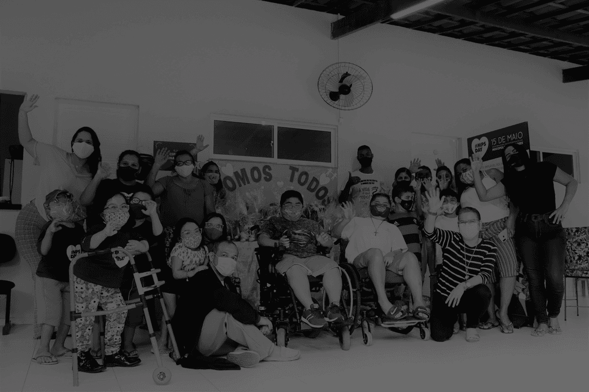

# ACDG Tecnologia

Repositorio publico e open source da equipe de tecnologia da **ACDG**.

Nosso objetivo e desenvolver tecnologia de alto impacto para doencas raras e compartilhar esse conhecimento para que outras associacoes tambem possam evoluir digitalmente, com autonomia, qualidade e responsabilidade social.

---

## Introducao

### A ACDG

Fundada em 2001, no estado do Ceara, a ACDG (Associacao Brasileira de Profissionais Atuantes em Doencas Geneticas, Pacientes, Familiares e Voluntarios) consolida-se como uma referencia nacional no acolhimento integral.

Em 2026, celebramos um marco historico: **25 anos de atuacao ininterrupta** transformando a realidade das doencas raras no Brasil. Embora nossa genese tenha sido marcada pela bravura de uma iniciativa independente, nossa evolucao foi pautada pela construcao de pontes. Compreendemos que a complexidade das doencas raras exige uniao. Hoje, transformamos o esforco individual em uma robusta rede de apoio intersetorial, articulando forcas com outras associacoes, governo e sociedade civil para potencializar a luta pelos pacientes.

Esse trabalho em rede impulsionou um crescimento exponencial na excelencia da assistencia clinica e terapeutica. Apenas no ultimo bimestre de 2025, nossa equipe multidisciplinar (Fisioterapia, Fonoaudiologia, T.O., Psicologia) realizou **1.064 atendimentos especializados**.

Possuimos expertise no manejo clinico de doencas como Fabry, Gaucher, MPS, Pompe, AME, Duchenne, entre outras.

Alem disso, entendemos que o tratamento nao comeca na clinica, mas no acesso a ela. Por isso, mantemos uma solida frente de advocacia e garantia de direitos que ja auxiliou mais de **250 pacientes**. Nossa equipe juridica atua para tornar a jornada burocratica mais leve e esclarecida, assegurando, via SUS ou saude suplementar, desde o fornecimento de medicamentos de alto custo ate a obtencao de cadeiras de rodas e insumos vitais.

Toda essa mobilizacao nao e um fim em si mesma, mas uma resposta necessaria a um cenario de urgencia. A ACDG existe e resiste porque o panorama das doencas raras no Brasil exige atuacao vigorosa para preencher lacunas historicas.

> **Nossa Missao:** ser o elo catalisador da inclusao e garantia de direitos para pessoas com doencas geneticas e raras.
>
> **Nossa Visao:** ser referencia nacional como modelo de acolhimento integral, unindo saude e direito.

---

## A Relevancia da Causa

As doencas geneticas raras representam um dos desafios mais complexos para a saude publica. A definicao do Ministerio da Saude estabelece como rara a doenca que afeta ate 65 pessoas a cada 100.000 individuos. No entanto, existem entre 6.000 e 8.000 tipos dessas enfermidades.

Quando somadas, deixam de ser um problema de minorias e se tornam uma questao de multidoes.

### Comparativo Populacional: a "Nacao dos Raros"

Se as pessoas com doencas raras no Brasil formassem um pais, ele seria maior que nacoes inteiras da Europa.

| Regiao / Pais | Populacao (milhoes) |
| --- | ---: |
| Regiao Sul do Brasil | 31.3 Mi |
| "Nacao dos Raros" (BR) | 13.0 Mi |
| Belgica | 11.7 Mi |
| Portugal | 10.4 Mi |

*Estimativa Populacional (2025)*

O Brasil tem hoje cerca de **13 milhoes** de pessoas vivendo com doencas raras. E esse numero se amplia quando consideramos familias, cuidadores e redes de apoio.

### A Jornada do Paciente Raro e o Custo da Negligencia

Em media, um paciente raro leva de 5 a 7 anos para obter diagnostico correto. Nesse percurso, o impacto e fisico, financeiro, social e psicologico.

- Atrasos no diagnostico agravam o quadro clinico.
- Acesso tardio a tratamento aumenta custos ao sistema de saude.
- Falta de informacao gera isolamento social e vulnerabilidade.

A ACDG atua para reduzir essa jornada, oferecendo suporte tecnico, juridico e humano.

---

## Nosso compromisso com tecnologia open source

Este e o repositorio publico da equipe de tecnologia da ACDG. Aqui, desenvolvemos ferramentas, padroes e conhecimento tecnico com uma direcao clara:

- impulsionar a tecnologia ao maximo pela causa das doencas raras;
- ampliar acesso, transparencia e colaboracao entre associacoes;
- permitir que outras instituicoes sem fins lucrativos reaproveitem e evoluam nossas solucoes.

## Organizacao sem fins lucrativos

A ACDG e uma associacao sem fins lucrativos. Nossa estrategia de tecnologia segue o mesmo principio:

- foco em impacto social e garantia de direitos;
- codigo aberto para gerar beneficio coletivo;
- colaboracao interinstitucional em vez de barreiras proprietarias;
- responsabilidade com seguranca, dados sensiveis e etica no uso de tecnologia.

## Como contribuir

Contribuicoes sao bem-vindas de pessoas voluntarias, profissionais de tecnologia, pesquisadores e organizacoes parceiras.

- Abra uma issue com proposta, melhoria ou relato.
- Envie PR com escopo claro e evidencias de validacao.
- Compartilhe boas praticas que possam fortalecer o ecossistema das doencas raras.

Juntos, queremos construir uma base tecnologica aberta, reutilizavel e sustentavel para fortalecer quem cuida e quem luta pelos pacientes raros no Brasil.
